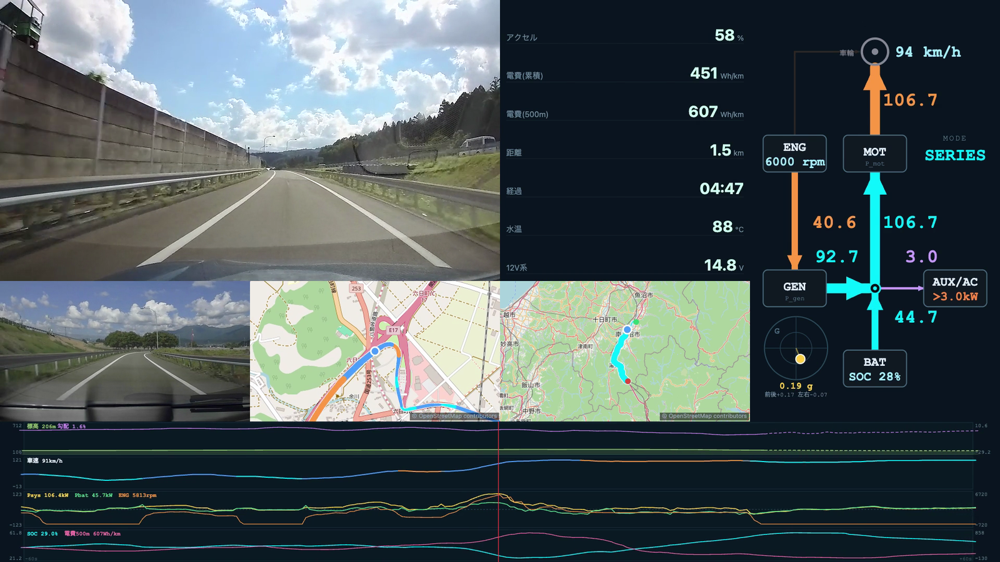

# 🚗 FL4 OBD MONITOR

Honda CIVIC e:HEV (FL4) 向け OBD-II リアルタイムモニター。
ELM327 BLE ドングル経由で、アナログメーター表示・**i-MMD エネルギーフロー図**・HVバッテリー監視・ログ記録ができる Web アプリ。

| | |
|---|---|
| **モニター** | [https://k4n4ch.github.io/fl4obd/](https://k4n4ch.github.io/fl4obd/) |
| **ログビュワー** | [https://k4n4ch.github.io/fl4obd/viewer.html](https://k4n4ch.github.io/fl4obd/viewer.html) |
| **走行リプレイ** | [https://k4n4ch.github.io/fl4obd/replay.html](https://k4n4ch.github.io/fl4obd/replay.html) |
| **走行動画 × テレメトリ** | [https://k4n4ch.github.io/fl4obd/video.html](https://k4n4ch.github.io/fl4obd/video.html) |
| **ドラレコ 走行ビューア** | [https://k4n4ch.github.io/fl4obd/dashcam.html](https://k4n4ch.github.io/fl4obd/dashcam.html) |



---

## 必要なもの

**モニター（走行中の計測・ログ記録）**

- **Android スマートフォン**（Chrome ブラウザ）
- **ELM327 BLE OBD-II ドングル**（Bluetooth 4.0以降対応のもの）
- OBD-II ポートへの接続（車両エンジン始動または IG-ON 状態）

> iOS (Safari) は Web Bluetooth 非対応のため使用不可。

**ログビュワー／走行リプレイ**

- 記録済みログを読むだけなので**車両もドングルも不要**。PC の Chrome でも動く。

**走行動画 × テレメトリ**

- 上記に加えて**ドライブレコーダー**。動作確認機種は Honda 純正
  **[DRH-224SD 前後2カメラセット](https://www.honda.co.jp/ACCESS/civic/driverecorder/driverecorder/)**（品番 08E30-PM5-C04A、OEM は JVCKENWOOD）。
- **GPS 付きで NMEA ログを SD に出力する機種**であれば他機種でも動く（時刻同期は NMEA を基準にしている）。
- 再生は PC / Android の Chrome。**書き出しは Windows / Mac の Chrome ＋ ローカル ffmpeg**。

---

## 起動手順

1. OBD-II ドングルを車両の OBD ポートに挿す（運転席足元のダッシュボード下）
2. スマートフォンの Bluetooth をオンにする
3. [このページ](https://k4n4ch.github.io/fl4obd/) を Chrome で開く
4. **[ BLUETOOTH 接続 ]** をタップ
5. スキャン結果からドングルを選択
6. `CONNECTED` と表示されれば接続完了、データが自動的に表示される

---

## 画面説明

上部の **GAUGE / FLOW タブ**で2つの表示を切り替えられる。

### GAUGE（アナログメーター 3×2）

| メーター | 表示内容 | 範囲 |
|---------|---------|------|
| Vsp | 車速 | 0〜180 km/h |
| Psys | システム出力（車輪出力。橙=駆動、紫=回生） | −140〜+140 kW |
| Peng | エンジン出力 | 0〜110 kW |
| Pbat | HVバッテリー電力（橙=放電、紫=充電） | −50〜+50 kW |
| ENGrpm | エンジン回転数 | 0〜8,000 rpm |
| Psoc | HVバッテリー残量（SOC） | 0〜100 % |

メーター下のテキスト行：

| 項目 | 内容 |
|------|------|
| RUN MODE | 動作モード（EV / SERIES / DIRECT）。EV↔他モードの遷移コードは直前モードを保持し中間表示を抑制 |
| Vsys | 12V系補機バッテリー電圧 [V] |
| RUNTIME | エンジン始動からの経過時間 |

### FLOW（エネルギーフロー図）

i-MMD（2モーターHV）の電力の流れを、**ENG / GEN / MOT / BAT / AUX-AC ＋ 車輪**のノード間を結ぶ矢印で可視化する。
中央の電気バス（◎）に GEN・MOT・BAT・AUX が接続され、走行モードごとに流れの向き・色・太さが変化する。

- **色** … 経路：機械=橙／電気=シアン、状態：回生=緑、補機=紫
- **線の太さ・矢じり** … 電力の大きさ [kW]（大きいほど太い）
- **向き** … パワーの方向（力行 ↔ 回生で反転）
- **AUX/AC ノード** … 電気バスで収支の合わない分（DC-DC・12V系・A/C 等の補機消費）を集約。表示はエネルギー保存を満たす。実測上限（≈2.5kW）を大きく超える残差はモデル不整合なので `>3.0kW` と橙色で飽和表示する
- **エンブレ廃電** … SOC 満充電時、回生電力を GEN でエンジンを回して（エンジンブレーキ）熱で捨てる制御。GEN↔ENG が通常と逆向き（bus→GEN→ENG）になり、ENG に「廃電」バッジが出る
- **中央上段** … 現在のモード（EV / SERIES = 水色、DIRECT = 橙、遷移 = グレー）。**枝の有無はモードで決定的に決まる**（EV はエンジン系の枝なし／純粋な直結は GEN 枝なし＝実測で pgen が完全にゼロ／遷移中は GEN 枝あり）。エンジン出力は車軸と発電機に分配され二重計上しない
- **各ノード数値** … ENG=回転数、車輪=車速、BAT=SOC

> **データ取得**：車両/パワトレ系（Vsp・Psys・Peng・Pbat・ENGrpm・RunMode・GEN/MOTトルク）は
> パワトレECU(0x07)の拡張DID `2920` を1本読むだけで取得（UDS Service 22、マルチフレーム）。
> **現行アプリがポーリングするのは `222920`（ホットループ）と `015B`（SOC・30秒毎）の2本だけ**。
> `0142`(12V) と `019A`(HV電圧/電流) のポーリングは廃止した：**12V系電圧は 2920 の byte14**（×0.1V/LSB、PID42 と r=1.000）、**Pbat は 2920 の `batt_pwr`** から直接得る。
> 枠を 2920 に寄せた結果、2920 は ~2Hz（往復 ~450ms が BLE 律速の上限）で回る。SOC の間隔 30 秒は ∫Pbat 内挿で埋める（中央 ~0.2% 精度）。
> 表示・グラフの SOC は、疎な 5B の間を 2920 のバッテリ電力積算（∫Pbat×較正 −192%/kWh）で**内挿して 2920 更新に同期**させる（5B 到来で再アンカー）。手法・較正・精度検証（実車ログで中央 ~0.2%、5B は 30s まで間引き可）は **[SOC内挿の検証メモ](docs/soc-interpolation.md)** を参照。
> Peng = 2.09e-6 × eng_trq × ENGrpm、車輪出力 = 0.000147 × drv_trq × Vsp、
> P_gen = `gen_trq`（0.0374 Nm/LSB）× ENGrpm（ENG-GEN 同軸）から算出。

---

## 信号の同定について（技術レポート）

本アプリが表示する各パラメータ（動作モード・各軸回転数・バッテリ電力・モーター/エンジン/発電機トルク・車輪出力・踏面駆動力など）は、Honda Civic FL4（i-MMD）のパワトレECU（`0x07`）が返す UDS Service 22 拡張DIDを、**公開情報（標準OBD-II PID・車両諸元・実走ログ）と物理法則のみ**でリバースエンジニアリングして同定したものである。メーカー内部資料は用いていない。

各信号の同定手法・根拠・変換係数・限界、および車輪出力／踏面駆動力の再構成は、技術レポートにまとめている。

📖 **[解析レポート（Markdown・GitHubでそのまま閲覧）](docs/did-analysis/fl4-did-analysis.md)** ／ 📄 **[PDF版（全20p, 2段組）](docs/did-analysis/fl4-did-analysis.pdf)**


---

## ボタン操作

ハイライト（橙）は「そのボタンの効力が有効である」ことを表す。**状態を切り替えるボタンはその状態が持続している間**、**行為を実行するボタンは実行している間**だけ点灯する。

| ボタン | 動作 |
|--------|------|
| **GAUGE / FLOW** | 上部タブ。アナログメーターとエネルギーフロー図を切替（左右スワイプでも切替可） |
| **[ BLUETOOTH 接続 ]** | BLE スキャン開始・接続 / 接続中は切断 |
| **● REC** | ログ記録開始。もう一度タップで停止→テキストファイルをダウンロード |
| **[ GPS ]** | GPS(GPX)記録の有効/無効。ON 中に REC で録画すると、停止時に GPX も同時出力 |
| **[ DEMO ]** | 未接続時に模擬データで動作確認（接続中は無効） |
| **[ VIEWER ]** | ログビュワー（`viewer.html`）を別タブで開く |
| **[ REPLAY ]** | 走行リプレイ（`replay.html`）を別タブで開く |
| **[ VIDEO ]** | 走行動画 × テレメトリ（`video.html`）を別タブで開く |

---

## ログ記録

1. **[ ● REC ]** をタップして記録開始
2. 走行・操作を行う
3. **[ ■ STOP ]** をタップ → `fl4obd_YYYY-MM-DDTHH-MM-SS.txt` がダウンロードされる

ログにはタイムスタンプ付きで送受信コマンドと解析結果が記録される。

---

## ログビュワー

記録したログファイルをグラフで可視化できる。**[viewer.html](https://k4n4ch.github.io/fl4obd/viewer.html)** を開き、ログファイルをドラッグ&ドロップするだけで動作する。上部の **GRAPHS / FLOW タブ**で切替える。

### GRAPHS（各変数のグラフ）

| チャート | 表示内容 |
|---------|---------|
| SPEED / MODE / SOC | 車速・動作モード・SOC |
| RPM / P_eng | エンジン回転数・エンジン出力 |
| P_wheel / P_bat | 車輪出力・HVバッテリー電力（DID 2920 から算出） |
| SYSTEM VOLTAGE | 12V系補機バッテリー電圧 |

- **グラフをドラッグ**すると、その時刻に縦カーソルが移動し、**FLOW タブのエネルギーフロー図がその瞬間の状態に同期**する（時刻はタブ間で共有）。

### FLOW（フロー再生）

デバッグログ内の DID `2920` を1フレームずつ再生し、モニター画面と同じ **i-MMD エネルギーフロー図**（ENG/GEN/MOT/BAT/AUX-AC ＋車輪）をアニメーション表示する。

- **▶ 再生 / ⏸ 一時停止**、**再生速度**（0.25×〜16×）、**シークバー**で任意位置へ
- 再生位置は GRAPHS タブの縦カーソルと双方向に同期

対応ファイル形式：
- `fl4obd_*.txt`（デバッグログ）… GRAPHS 全チャート＋FLOW 再生に対応
- `fl4obd_data_*.csv`（旧データログ・現行アプリは非出力）… GRAPHS のみ（2920 生フレームを含まないため FLOW 非対応。ビュワーは互換のため引き続き読込可）

## 走行リプレイ（地図＋GPS）

GPS 付きの走行を OpenStreetMap 上で再生する。**[replay.html](https://k4n4ch.github.io/fl4obd/replay.html)** を開き、**GPX（GPSトラック）とフレームログ（.txt）の2ファイル**を読み込むと、3画面ダッシュボードで同期再生する。

- **俯瞰**：走行コース全体（走行済み＝明／未走行＝暗、始点・終点・現在地）
- **ナビ**：自車を中心に地図が動く（北固定・ズーム可変）
- **パワーフロー**：その時刻の i-MMD エネルギーフロー図

走行線は**モードで色分け**（EV=水色／SERIES=青／DIRECT=橙／遷移(TRANS)=グレー）・**車速で線幅**・白フチ付きで、下地の道路色に埋もれない。**📊 サマリー** ボタンで走行距離・時間（総／走行）・平均車速（総／走行中）・電費（∫Peng+∫Pbat／距離）、消費エネルギーの内訳（消費＝駆動+AUX、うち回生を除いた分が電費）、走行中の EV/SERIES/DIRECT 配分を時間・距離の2軸でスロープ図表示する（各モードの時間比と距離比をリボンで結び、シフトが分かる）。

**📈 グラフ** ボタンで、時間軸に沿った 標高・勾配・車速・足軸/電池パワー・SOC・エンジン回転数・モード帯の時系列を表示（**赤線＝現在時刻は常に中央**で、再生とともにグラフがスクロール。**左右ピンチ（PCはマウスホイール／トラックパッドのピンチ）で赤線を中心に時間軸ズーム**。時刻移動は下の再生バーで）。

再生バー（再生/停止・シーク・速度 1〜10×）で任意位置へ。サマリー/グラフのパネルは再生バーを覆わないので、開いたまま再生・シークできる。GPX と .txt は時刻（UTC）で自動結合する。GPS ログはモニター画面の **[GPS] トグル**を ON にして録画すると出力される。

---

## 走行動画 × テレメトリ（ドラレコ合成）

ドラレコ映像に、その瞬間のパワーフロー・マップ・前後左右G を重ねて再生・書き出しする。
**[video.html](https://k4n4ch.github.io/fl4obd/video.html)** を開き、**OBD ログ（.txt）／GPX（省略可）／ドラレコ SD カードのフォルダ**を渡す。

```
┌──────────────────────────┬─────────────┐
│  前方カメラ 1280×720      │ パワーフロー │
│  （原寸・無加工）          │  640×720    │
├─────────────┬────────────┼─────────────┤
│ リアカメラ   │ ナビ        │ 俯瞰        │
│  640×360    │  640×360   │  640×360    │
└─────────────┴────────────┴─────────────┘
```

- **1920×1080 固定ステージ**で、**画面に見えている絵がそのまま書き出し結果**になる（操作バーはステージ外）。
- 前方カメラのセルは 1280×720 なので、ドラレコを**拡張モード（1280×720）**で記録していると**原寸・無加工**で入る。標準の 1920×1080 で記録した場合はセルに合わせて縮小される（動作はする）。
- SD カードを丸ごと渡してよい。**OBD ログの時間帯に一致するクリップだけを自動で選ぶ**（ファイル名の書式や機種のフォルダ構成に依存しない）。前方／リアは同名クリップを自動対応づけ。
- **時刻同期は全自動**。ドラレコ映像・NMEA・OBD ログ・GPX を共通の絶対時刻軸に載せ、スマホ側の時計オフセットは走行ごとに実測する（手動合わせは不要）。同期結果は `sync.json` として保存できる。
- **前後左右G**はドラレコ内蔵 IMU（NMEA の `$GSENS` 10Hz）から表示。ボールは体が押される方向に動き、合成G も併記する。
- **書き出し**：テレメトリだけを 1 本のファイル（H.264）に書き出し、映像との合成は**ローカルの ffmpeg 1 コマンド**で行う（コマンドは `compose.txt` に生成される）。Windows / Mac 共通。
- **書き出す区間を選べる**：再生位置を合わせて操作バーの **[ 始点** / **終点 ]** を押すと、その区間だけ書き出す（**区間解除**で全体に戻る）。
- 再生は Android Chrome でも可（フォルダ選択が使えないので MP4 と NMEA を複数ファイル選択で渡す）。書き出しは Win/Mac 用。

---

## ドラレコ 走行ビューア（OBD 不要）

**ドラレコの SD カードだけ**で走行を振り返る。OBD ドングルもスマホのログも要らない。
**[dashcam.html](https://k4n4ch.github.io/fl4obd/dashcam.html)** を開き、SD カードのフォルダを渡すだけ。

```
┌──────────────────────────┬─────────────┐
│                          │ リアカメラ   │
│  前方カメラ 1280×720      ├─────────────┤
│                          │ ナビ 640×360 │
├──────────────────────────┼─────────────┤
│ 標高/勾配・車速・前後左右G  │ 俯瞰 640×360 │
│        1280×360          │             │
└──────────────────────────┴─────────────┘
```

- **前後カメラの同期再生**、**地図（経路・現在位置）**、**車速**、**標高・勾配**、**前後左右G**。
- **前後左右G はトンネル内でも途切れない**。ドラレコ内蔵 IMU は GPS と無関係に動き続けるため、測位できない区間で唯一生きているセンサになる。
- 車速は GPS の位置差分から出す。OBD 車速との実測一致は**中央 0.5 km/h**（95% 1.6 km/h）。
- 経路は車速で色分け（**30以下 / 60以下 / 80以下 / 100以下 / それ超**）。区切りは制限速度に合わせた丸い数字で、30 は下の帯に入る。
- **測位が途切れた区間（トンネル等）は OSM の道路形状から経路を補う**（破線で表示）。距離の配分は「経路長 ÷ 途絶時間の一定速度」。合否は「含意される平均速度が両端の実測速度と釣り合うか」で判定し、落ちた区間は線を切る（繋ぐと走っていない直線が描かれるため）。
- **補完区間の標高・勾配は出さない**。走行抵抗からの逆算が要り、それには OBD の駆動パワーが必要なため（→ `video.html`）。車速も仮定値なので破線＋「（推定）」で区別する。
- SD カードを丸ごと渡してよい。**15 分以上空いたら別の走行**として塊に分け、**一覧から選ぶ**（新しい順・開始時刻・長さ・クリップ数を表示）。走行が 1 件しか無ければそのまま読み込む。
- 一覧を出す時点では **NMEA の先頭 4KB しか読まない**。全文解析するのは選ばれた走行のクリップだけなので、数日分入った SD でも待たされない。
- 時刻同期・セッション判定は `video.html` と同じ `video/sync.js` を使う。
- **書き出し**：地図とグラフを 1 本のファイル（H.264）に書き出し、映像との合成は**ローカルの ffmpeg 1 コマンド**で行う（コマンドは `compose.txt` に生成される）。映像セルは黒のまま出力し、ffmpeg が上に重ねるので crop が要らない。地図の縮尺は書き出しボタンを押した時点の表示状態に固定される。
- **書き出す区間を選べる**：再生位置を合わせて操作バーの **[ 始点** / **終点 ]** を押すと、その区間だけ書き出す（**区間解除**で全体に戻る）。長い走行から一部だけ切り出すときに使う。

**対応機種**: Honda 純正ドラレコ（DRH-224SD / 08E30-PM5-C04A、JVCKENWOOD OEM）で検証。
MP4 と同名の `.NMEA` を書く機種なら、機種判定を足せば流用できる。GPS を MP4 内に埋め込む
方式の機種には未対応。

**出せないもの**（OBD が要る → `video.html`）: パワー・SOC・電費・走行モード、
トンネル等の測位途絶の経路補完。

詳細・同期の仕組み・実装メモは **[video/README.md](video/README.md)** を参照。

---

## よくある問題

**接続できない**
- Bluetooth がオンになっているか確認
- ドングルが OBD ポートに正しく挿さっているか確認
- Chrome ブラウザを使用しているか確認（Safari・Firefox 不可）
- ページが HTTPS または localhost で開かれているか確認

**データが `--` のまま**
- エンジンが始動しているか確認（IG-ON 以上が必要）
- ログに `NO DATA` が連続している場合はドングルの相性問題の可能性あり

**走行中に切れる / データが止まる**
- BLE が切れても**自動で再接続**する（`bleDevice` を保持し `gatt.connect()` を指数バックオフで再試行。状態は `RECONNECTING` 表示。手動で `[ 切断する ]` を押すと自動再接続は止まる）。無応答が続く張り付きも検知して能動的に再接続する
- **別アプリを前面に出す／画面ロックすると取得は止まる**（Android Chrome がバックグラウンドのタイマー/BLE処理を停止するため。Web の制約で回避不可）。前面に戻すと自動的にポーリングを再開する。連続ロギングは**アプリを画面に出したまま**行う（画面はウェイクロックで消えない）。画面OFF放置で撮りたい場合は実機ロガー（ATmega/Pico）の領分


